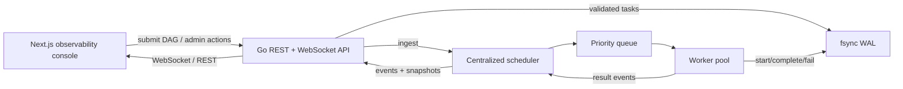

# OrionScheduler

OrionScheduler is a single-node, crash-consistent DAG scheduler written in Go with a Next.js observability console.

It is intentionally not a distributed scheduler. The core design choice is a centralized scheduler because deterministic recovery, correctness, and interview explainability matter more here than premature multi-node coordination.

## What It Demonstrates

- DAG validation with duplicate-ID, unknown-dependency, and cycle rejection.
- Kahn-style scheduling with dependency-aware task release.
- Priority queue based dispatch into a concurrent worker pool.
- fsync-backed write-ahead log for crash-consistent recovery.
- Retry handling for task failures and cascade failure for downstream dependents.
- Crash/recover simulation where the HTTP process stays alive while the scheduler and workers restart from WAL replay.
- Real-time UI that shows task flow, worker state, event stream, and derived system internals.

## Demo Story

The fastest way to understand the system is:

1. Open the console.
2. Run the auto-demo.
3. Watch a DAG enter the scheduler, workers execute tasks, the scheduler crash, and recovery replay the WAL.
4. Switch to manual mode and submit smaller DAGs, failure-heavy DAGs, or priority-heavy DAGs.

The project is designed to support this interview answer:

> I kept scheduling centralized because deterministic replay and correctness were the goal. The scheduler owns DAG state, workers only execute tasks, and the WAL is the source of recovery truth. That keeps failure handling explainable while still demonstrating concurrency, backpressure, retry, cascade failure, and crash recovery.

## Architecture



## Guarantees And Tradeoffs

- Crash recovery is based on local WAL replay, not replicated consensus.
- Scheduling is centralized to avoid split-brain and leader-election complexity.
- The system demonstrates at-least-once execution semantics, not exactly-once execution.
- The UI distinguishes backend-reported state from event-derived views.
- Admin crash/recover endpoints are demo controls and should be protected in public deployments.

## Local Development

### Backend

```bash
go run ./cmd/server
```

The backend defaults to `http://localhost:8080`.

Useful environment variables:

- `PORT`: backend port.
- `WAL_PATH`: WAL file path. Use a throwaway path for demos and tests.
- `WORKER_COUNT`: number of execution workers.
- `CORS_ORIGIN`: exact frontend origin for public deployments.
- `WS_ORIGIN`: exact WebSocket origin for public deployments.
- `ADMIN_TOKEN`: optional demo token required for crash/recover endpoints.

### Frontend

```bash
cd frontend
npm ci
npm run dev
```

Frontend environment variables:

- `NEXT_PUBLIC_API_URL`: deployed backend URL, for example `https://orion-scheduler-api.onrender.com`.
- `NEXT_PUBLIC_WS_URL`: deployed WebSocket URL, for example `wss://orion-scheduler-api.onrender.com/ws`.
- `NEXT_PUBLIC_ADMIN_TOKEN`: demo token sent by the console to crash/recover endpoints. This is public once bundled; it is demo integrity protection, not real auth.

## Deployment Notes

Backend deployment target: Render web service.

- Runtime: Go.
- Build command: `go build -tags netgo -ldflags '-s -w' -o app ./cmd/server`.
- Start command: `./app`.
- Health check path: `/readyz`.
- The server binds to Render's `PORT` environment variable.
- Free tier is acceptable for one public demo, but the filesystem is ephemeral. WAL replay works for the in-process crash/recover demo; WAL state is not guaranteed across Render restarts, redeploys, or spin-downs.
- Set exact `CORS_ORIGIN` and `WS_ORIGIN` to `https://orion.hrushikeshramilla.in`.
- Set `ADMIN_TOKEN` before sharing a public demo. This is demo integrity protection, not an auth system.

Frontend deployment target: Vercel.

- Use `npm ci` for deterministic installs.
- Set `NEXT_PUBLIC_API_URL` and `NEXT_PUBLIC_WS_URL`; do not rely on localhost fallbacks in production.
- For one public recruiter demo, set `NEXT_PUBLIC_ADMIN_TOKEN` to match the Render `ADMIN_TOKEN` so auto-demo crash/recovery works from the public URL.
- Add the production custom domain `orion.hrushikeshramilla.in` in the Vercel project.

## Test Commands

```bash
go test ./...
cd frontend && npm run lint && npm run build
```

## What This Project Does Not Claim

OrionScheduler is not Raft, not Kubernetes, not a Kafka replacement, and not a multi-node distributed scheduler. It is a deliberately scoped, deeply engineered single-node orchestration system optimized for crash recovery, correctness, observability, and interview explainability.
