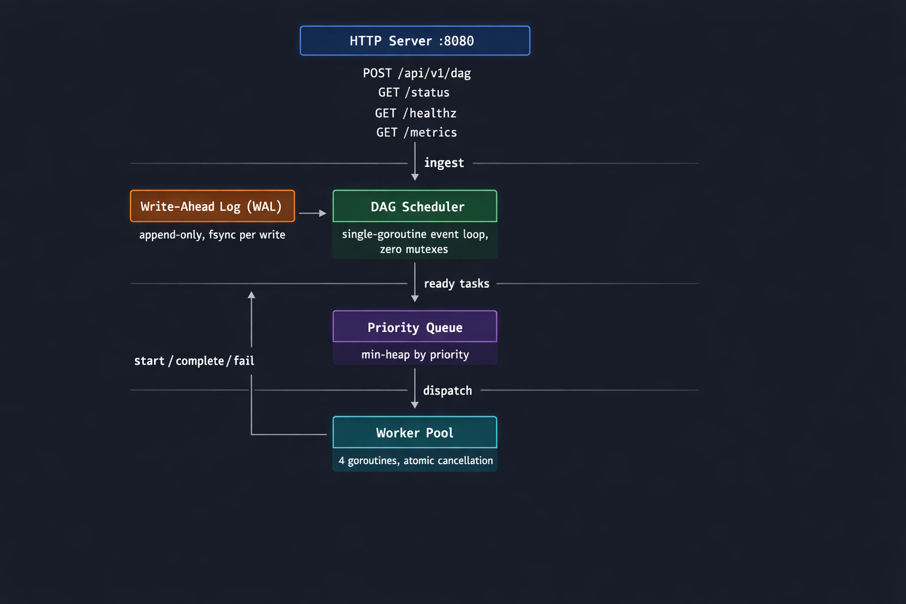
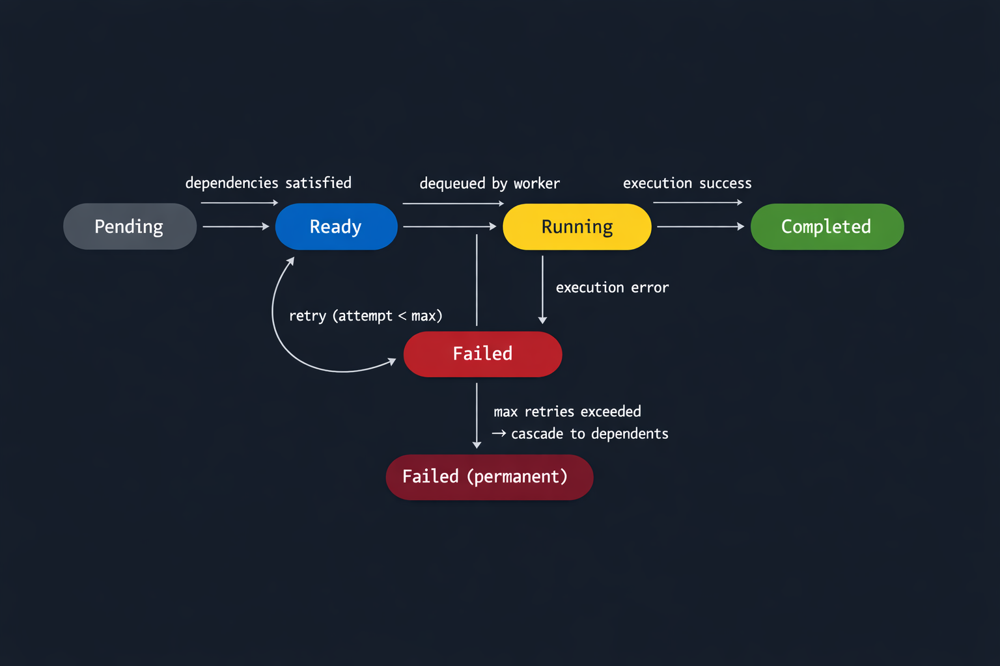
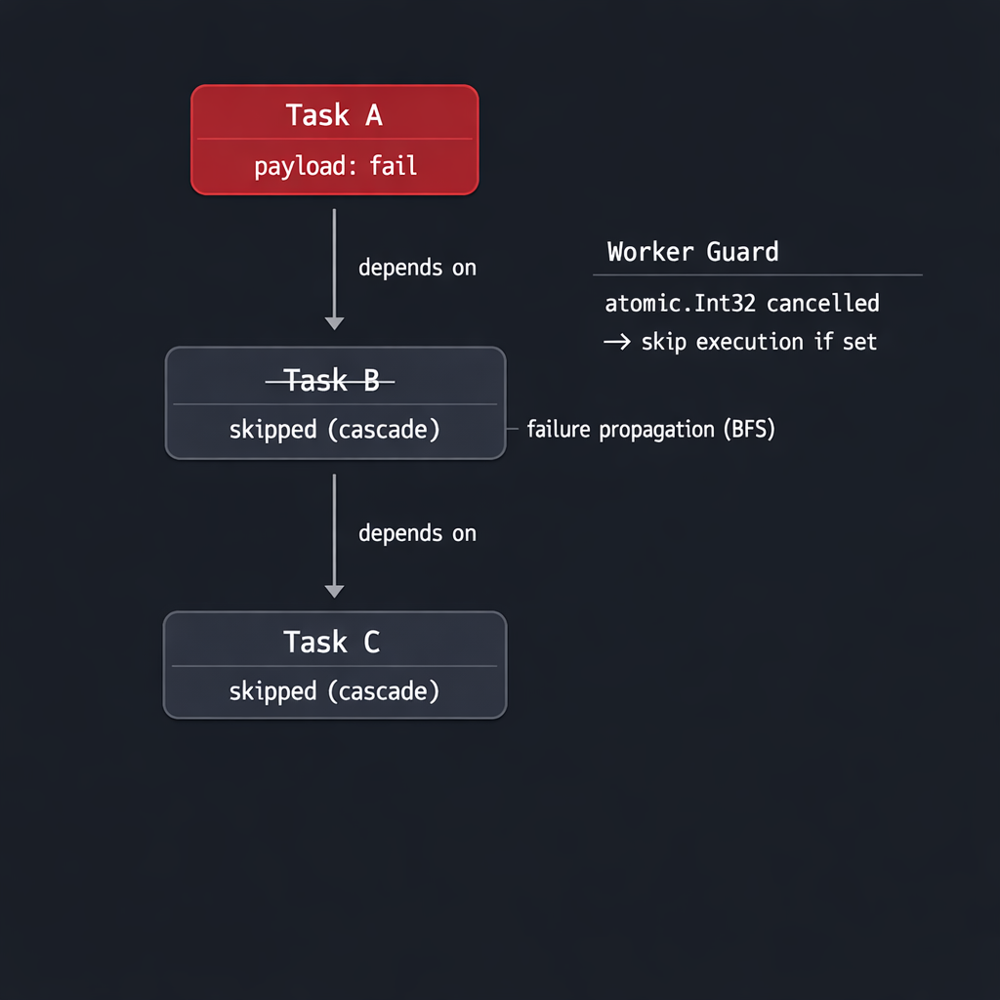
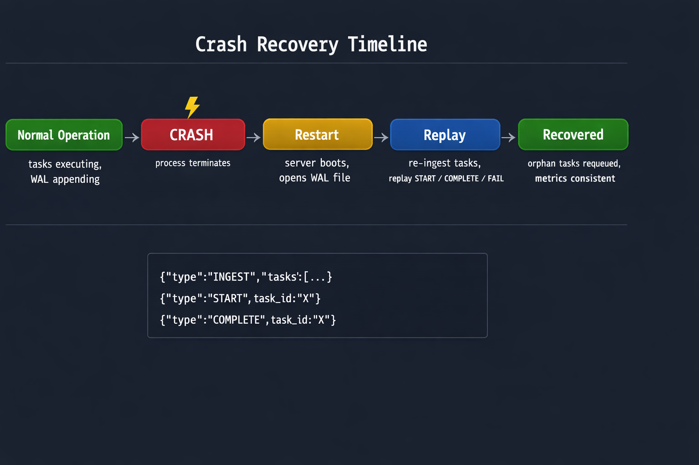

# OrionScheduler

**A high-performance, crash-consistent DAG execution engine built in Go.**
*Topological scheduling, atomic state transitions, and disk-backed Write-Ahead Log (WAL) for 100% state durability.*


OrionScheduler is a concurrent task orchestrator that resolves complex dependency graphs, executes tasks through a priority-aware worker pool, and survives process crashes through write-ahead logging. Built in Go with zero external orchestration dependencies like Kafka or Redis.

---

## 🧠 Why This Problem Is Hard

Building a task scheduler is easy. Building one that is **correct under failure** is not.

The moment you introduce concurrency, dependencies, and crash recovery into a single system, you get a collision of invariants that fight each other:

- **The Race to Completion**: A worker dequeues a task. While it executes, the scheduler cascade-fails that task. Who wins? If the worker calls `Complete()`, it unlocks dependents that should be dead. If the scheduler overwrites the status, you have a data race.
- **The In-Flight Mystery**: The process crashes mid-execution. On restart, how do you know which tasks were in-flight? If you re-execute them, you might double-run. If you skip them, you lose work.
- **Lock Contention**: The scheduler resolves dependencies, manages retries, and dispatches tasks — all from multiple goroutines calling into shared state. A single mutex creates deadlocks under load. No mutex creates races.

OrionScheduler solves all three through a disciplined architecture of single-ownership and atomic signaling.

---

## 🏗️ Architecture



### The Single-Owner Event Loop
Why a single-goroutine event loop? The scheduler owns all mutable DAG state — task map, in-degree counters, dependency graph, and ready queue. Instead of protecting this with a mutex (which caused deadlocks in early versions), all mutations flow through channels into a single `runLoop` goroutine. 

This follows the "Actor Model" pattern found in Redis and Node.js. By serializing all state changes into a single loop, we achieve:
*   **Zero Lock Contention**: No goroutines fighting for access to the task map.
*   **Deterministic Transitions**: State changes are sequential and easy to reason about.
*   **Data Consistency**: The engine never sees a "partial" update.

---

## 🔄 Task Lifecycle



| State | Meaning | Triggered By |
|---|---|---|
| `pending` | Ingested, blocked on dependencies | API submission |
| `ready` | All deps satisfied, in priority queue | In-degree reaches 0 |
| `running` | Picked up by a worker | Dequeued from heap |
| `completed` | Execution succeeded | Worker reports success |
| `failed` | Permanently failed or cascade-killed | Retries exhausted / upstream failure |

**Retry Loop**: On organic failure, tasks re-enter `pending` with exponential backoff (`2ˢ`, capped at 30s). After exhausting 3 retries (default), a permanent failure triggers the BFS cascade.

---

## 🛡️ Failure Handling & The Dual-Guard Pattern



When a task exhausts retries, `propagateFailure()` runs a **BFS traversal** through all transitive dependents to prevent a "zombie pipeline" from wasting compute on broken prerequisites.

### The Problem: Execution After Failure
If Task A fails and cascades to B, but B was already dequeued by a worker, B might still complete and unlock its dependents. 

### The Solution: Dual-Guard Pattern
The scheduler owns the `Status`. Workers cannot read it without a race. Instead, workers check an `atomic.Int32` cancellation flag at two critical points:

1.  **GUARD 1 (Pre-execution)**: `task.Cancelled.Load() == 1` → Skip execution entirely.
2.  **GUARD 2 (Post-execution)**: `task.Cancelled.Load() == 1` → Do NOT call `Complete()`.

This ensures that once a cascade marks a task as dead, no worker can ever "resurrect" the pipeline, and it costs zero in terms of lock performance.

---

## 💾 Crash Recovery (WAL)



### WAL Design
Every mutation is serialized to an append-only NDJSON file and `fsync`'d **before** the scheduler processes it. This guarantees that any acknowledged task submission or state change is durable across power loss.

### Replay Sequence on Restart
1.  **Parse WAL**: Line-by-line parsing to track byte offsets.
2.  **Truncate Corruption**: If a partial write is found (crash mid-write), the log is truncated at the last valid offset.
3.  **Replay States**:
    *   `INGEST` → Reconstruct DAG topology and in-degree maps.
    *   `START` → Mark as running and update live metrics.
    *   `COMPLETE` → satisfy dependents and enqueue newly-ready tasks.
4.  **Requeue Orphans**: Tasks marked as `START` but missing terminal events were in-flight at crash time. These are automatically re-queued into the `ready` pool.

---

## 🔍 Key Engineering Challenges (Post-Mortem)

These represent real architectural hurdles resolved during the development of the system:

### 1. System Deadlock (The Mutex Starvation)
*   **Symptom**: Under concurrent load, the system hung indefinitely without errors.
*   **Root Cause**: The scheduler used `sync.Mutex`. Workers called `Complete()`, which locked the mutex and tried to enqueue tasks. If the queue was full, it blocked while holding the lock, preventing the dispatch loop from ever freeing a slot.
*   **Fix**: Switched to the single-owner `runLoop` model. Workers now send IDs through channels; they never touch shared state.

### 2. Event Loop Starvation (The Metrics Bottleneck)
*   **Symptom**: Throughput dropped to near-zero when monitoring the UI.
*   **Root Cause**: API handlers called `scheduler.QueueSize()` via a channel round-trip to the `runLoop`. Under load, monitoring requests flooded the loop, starving actual work (ingests/completions).
*   **Fix**: Replaced with `atomic.Int64` counters. The loop increments them; the API reads them lock-free.

### 3. WAL Replay Inconsistency (The Ghost Tasks)
*   **Symptom**: After restart, metrics reported `pending` tasks that were actually finished.
*   **Root Cause**: Replay handlers updated task statuses but didn't adjust the atomic metric counters.
*   **Fix**: Unified state transitions so replay logic maintains the exact same invariants as the live execution path.

---

## 🎨 The Observatory (Frontend)

OrionScheduler includes a sophisticated real-time monitoring dashboard, built to visualize the internal state of the orchestrator without adding overhead to the execution core.

-   **Live DAG Visualizer**: Powered by `React Flow`, it reconstructs the dependency graph and animates state transitions (`pending` → `running` → `completed`) in real-time.
*   **System Metrics**: Live charting of throughput and latency using `Recharts`, synchronized with the backend via WebSockets.
*   **Crash Simulation UI**: Dedicated controls to "Pull the Plug" on the backend and trigger WAL recovery, allowing for interactive testing of the system-critical durability guarantees.
*   **Event Log**: A human-readable stream of every internal engine event, from worker assignments to BFS failure cascades.

---

## 🛠️ Tech Stack

### Backend (The Engine)
*   **Language**: Go 1.21+
*   **Concurrency**: Channels, Atomics, Worker Pools
*   **Storage**: Hand-rolled NDJSON Write-Ahead Log
*   **API**: Standard Library `net/http` + Gorilla WebSockets
*   **Metrics**: Prometheus + `promhttp`

### Frontend (The Observatory)
*   **Framework**: Next.js 14 (App Router)
*   **Styling**: TailwindCSS + Framer Motion
*   **Visuals**: React Flow (DAGs) + Recharts (Metrics)
*   **State**: React Hooks + WebSocket Streams

---

## 🛡️ Production Features

| Feature | Implementation | Why |
|---|---|---|
| **Idempotency** | `Idempotency-Key` header | Prevents double-submission from retrying clients. |
| **Rate Limiting** | Token bucket per IP | Prevents any single client from flooding the orchestrator. |
| **Backpressure** | Admission spin-wait | Returns `429` if the internal DAG pipeline is saturated. |
| **Health Probes** | `/healthz` & `/readyz` | Kubernetes-native deployment support. |
| **Observability** | Prometheus at `/metrics` | Real-time structured metrics and logging with `slog`. |

---

## 🚀 Getting Started

### 📦 Docker & Compose
```bash
# Run with one command
docker compose up -d

# Or manual Docker run
docker build -t orion-scheduler .
docker run -d -p 8080:8080 -v wal-data:/app/data orion-scheduler
```

### 💻 Local Development
**Backend (Go)**:
```bash
go run ./cmd/server
```

**Frontend (Observatory)**:
```bash
cd frontend
npm install
npm run dev
```

---

## 📊 API Interface

| Endpoint | Method | Description |
|---|---|---|
| `/api/v1/dag` | `POST` | Submit a DAG (requires `Idempotency-Key`). |
| `/api/v1/status` | `GET` | Retrieve global task counters. |
| `/api/v1/metrics/live` | `GET` | Detailed JSON metrics for dashboards. |
| `/ws` | `GET` | WebSocket for real-time task event streaming. |
| `/admin/recover` | `POST` | Manually trigger a WAL replay cycle. |

---

## 📂 Project Structure

```text
├── cmd/server/         # Entry point, wiring, graceful shutdown
├── internal/
│   ├── api/            # Handlers, idempotency, rate limiting
│   ├── engine/         # Scheduler loop, priority queues, workers
│   └── storage/        # WAL implementation & corruption handling
├── pkg/
│   ├── models/         # Task and Lifecycle definitions
│   └── telemetry/      # Prometheus metric definitions
└── frontend/           # Next.js 14 Dashboard / Observatory
```

---

## 📜 License

This project is licensed under the **MIT License**. 

The MIT License is a permissive free software license, allowing you to reuse the codebase for personal or commercial projects with minimal restrictions. See the [LICENSE](LICENSE) file for the full legal text.
